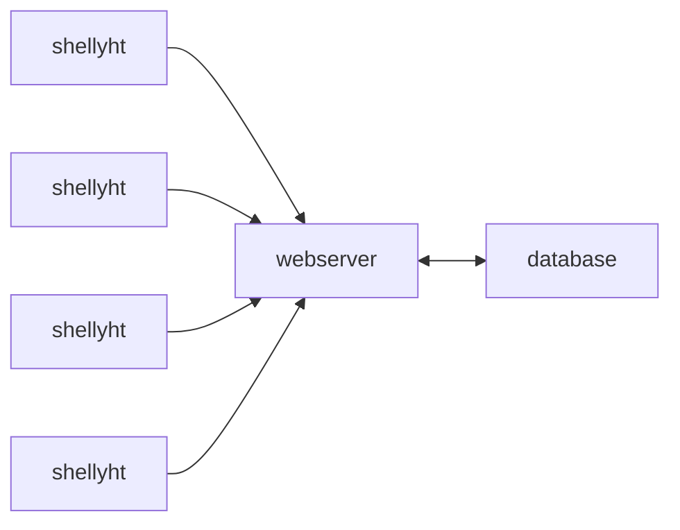

[](https://codecov.io/gh/varkenvarken/shellyhtcollector2)


[](https://pypi.org/project/htcollector/)

# Shellyhtcollector2

Gather incoming temperature and humidity updates from a small swarm of Shellyht devices.

## Intro

Shelly HT devices can be configured to send their measurements to a configurable server. The server is called using a simple HTTP GET request that by default uses an URL like

`http://mymachine:8083/sensorlog?hum=24&temp=42.38&id=shellyht-1234FA`

where the part `http://mymachine:8083/sensorlog` is something you configure in the sensor itself.

`htcollector` is a solution that intercepts these requests and logs the data in a database. It also provides means to associate meaningful labels with the station-ids and generate html, json or a png image with the latest measurements.

## Easy installation using Docker

`htcollector` is provided as an easy to use [Docker solution](https://hub.docker.com/u/varkenvarken) too:

You can simply download just a file with environment variables and a docker compose file and start that up with `docker compose` (watch the long curl lines!):

```bash
mkdir htcollector-docker
cd htcollector-docker
mkdir docker
cd docker
curl https://raw.githubusercontent.com/varkenvarken/shellyhtcollector2/master/docker/.env > .env
curl https://raw.githubusercontent.com/varkenvarken/shellyhtcollector2/master/docker/docker-compose.yml > docker-compose.yml
docker compose -f docker-compose.yml up -d
```

This will download two images and start them as two containers: one running a MariaDB server and one running the htcollector.

By default the htcollector is configured to listen on port 8083 for incoming measurements from the devices, but this can be changed of course (or you can change the configuration of your Shelly HT devices).

When measurements start getting logged, you can go to the same webserver to get an html page with the last measurements:

`http://mymachine:8083/html`

You can associate a meaningful label with any station, for example:

`http://mymachine:8083/name?id=shellyht-1234FA&name=Kitchen`


!!! note
    Tested with Docker version 20.10.12, build 20.10.12-0ubuntu2~20.04.1 / Docker Compose version v2.6.0

## API documentation

[Available on the GitHub pages of this repo](https://varkenvarken.github.io/shellyhtcollector2/apidoc/htcollector/)
## Architecture overview


## Installation as a library

You can of course build your own solution on top of the htcollector module but that takes a few steps. Installing the htcollector package from Pypi is simple enough but it also depends on the MariaDB connector.
### Install mariadb connector for Python
The `mariadb` python module is not pure Python and depends on `libmariadb`, so setup is less straight forward than you would hope:
``` bash
wget https://downloads.mariadb.com/MariaDB/mariadb_repo_setup
echo "d4e4635eeb79b0e96483bd70703209c63da55a236eadd7397f769ee434d92ca8  mariadb_repo_setup"     | sha256sum -c -
chmod +x mariadb_repo_setup
sudo ./mariadb_repo_setup    --mariadb-server-version="mariadb-10.6"
sudo apt install libmariadb3 libmariadb-dev
sudo python3 -m pip install mariadb
```
Here we have chosen to install it for everyone, but if you used a virtual environment your could do away with the `sudo`s

### Install the package

Install it directly from PyPi

```bash
pip install htcollector
```

or alternatively, download it from GitHub 

```bash
git clone https://github.com/varkenvarken/shellyhtcollector2.git
cd shellyhtcollector2
python setup.py install
```

!!! note
    It might be a good idea to do this inside a virtual environment!

## Running the server

Assuming you have MariaDB running on the same machine with a database (schema) `shellyht`,
and that the user defined in the environment variable DBUSER has enough privileges to create a tables,
the following command will create the necessary tables if not yet present and start listening on port 1883 for incoming connections:
```bash
nohup python3 -m shellyhtcollector&
```
## Additional configuration

The reporting tools assume that a table `StationidToName` exists that contains a mapping between StationId and Name.

A mapping for a stationid can be added or updated with the mapping tool, for example:

```
cd shellyhtcollector; python3 tools/mapping.py "shellyht-6A566F" "dining room"
```

Or, since you have the server running now, simply execute a http get

```
http GET "http://localhost:1883/name?id=shellyht-6A566F&name=dining room"
```


## Generating reports
An html file with the last recorded measurements can be generated with:
```
cd shellyhtcollector; python3 tools/last.py --html > index.html
```

Both commands assume that you have set two environment variables

- DBUSER
- DBPASSWORD

## Implementation details

A ShellyHT can be configured to log temperature and humidity changes to a certain host:port using HTTP. 

The path of a typical GET request will look for example like:

```
/sensorlog?hum=54&temp=23.4&id=shellyht-6A566F
```

The Webserver will *only* accept GET request that have that exact format.


