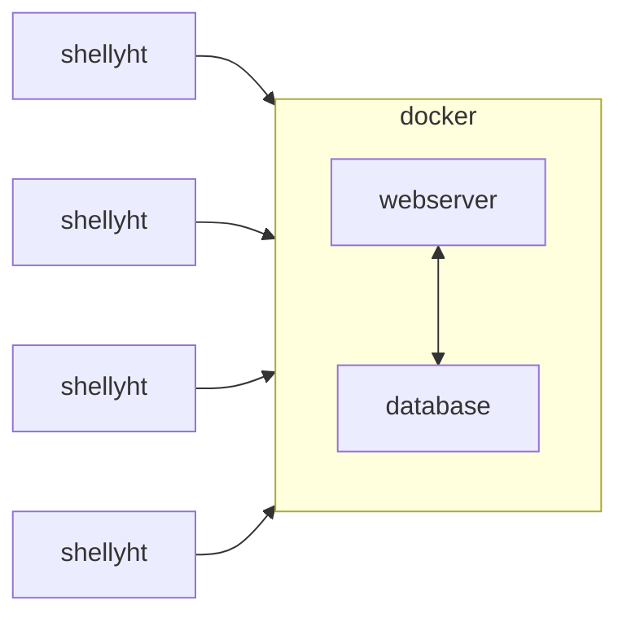

[](https://codecov.io/gh/varkenvarken/shellyhtcollector2)


[](https://pypi.org/project/htcollector/)

# htcollector

Gather incoming temperature and humidity updates from a small swarm of Shellyht devices.

[Intro](#intro)

[Installation and use](#installation-and-use)

[Security](#a-note-on-security)

[Installation as a library](#installation-as-a-library)

[API Documentation](#api-documentation)

## Intro

Shelly HT devices can be configured to send their measurements to a configurable server.
The server is called using a simple HTTP GET request like

`http://mymachine:8083/sensorlog?hum=24&temp=42.38&id=shellyht-1234FA`

where the part `http://mymachine:8083/sensorlog` is something you configure in the sensor itself.

`htcollector` is a solution that processes these requests and logs the data in a database.
It also provides means to associate meaningful labels with the station-ids and generate html or json data with the latest measurements.

## Installation and use

`htcollector` is comes as [two Docker images](https://github.com/varkenvarken?tab=packages&repo_name=shellyhtcollector2) than can be run on your docker installation.

To spin up a server you need to perform the following steps:

- Download a Docker compose file and an environment file

    You can of course adapt these files to your needs

- Download and start your containers

    A simple `docker compose up` will take care of both

- Configure your Shelly HT devices to point to your server

    This is documented in the Shelly HT manual

- Associate names with the Shelly HT station ids

    So that you can more easily identify your Shelly HT devices

After this, you can access the most recent measurments on `http://myserver:8083/all` (where `myserver` is the name of the machine you have started the docker containers on)

The steps are document in more detail in the following section.
### Installation: Step by step

`htcollector` is provided as an easy to use [Docker solution](https://github.com/varkenvarken?tab=packages&repo_name=shellyhtcollector2):

You can simply download just a file with environment variables and a docker compose file and start that up with `docker compose`.
In `bash` (on a a system with `curl` installed) that would look like (watch the long curl lines!):

```bash
mkdir htcollector-docker
cd htcollector-docker
mkdir docker
cd docker
curl https://raw.githubusercontent.com/varkenvarken/shellyhtcollector2/master/docker/.env > .env
curl https://raw.githubusercontent.com/varkenvarken/shellyhtcollector2/master/docker/docker-compose.yml > docker-compose.yml
docker compose -f docker-compose.yml up -d
```

This will download two images and start them as two containers: one running a MariaDB server and one running the htcollector.

By default the htcollector container is configured to listen on port 8083 for incoming measurements from the devices,
but this can be changed of course (or you can change the configuration of your Shelly HT devices).

When measurements start getting logged, you can go to the same webserver to get an html page with the last measurements:

`http://mymachine:8083/all`


The image will show the last measurement of any device that has contacted the server, along with the name of the device and the time of the last measurement.
It also shows a small graph that depicts the temperature in the last 24 hours.

To associate a label with a station, simply go to:

`http://mymachine:8083/names`


If you click on the `Change` link of the device you want to change the label of, you can enter a name.


!!! note

    Tested with Docker version 20.10.12, build 20.10.12-0ubuntu2~20.04.1 / Docker Compose version v2.6.0

### A note on security

`htcollector` has *no* safety features whatsoever: Authentication is not required and connections are not encrypted. Anybody can connect to the server and log measurements and anybody can change device names.

You could consider running it behind a reverse proxy with https enabled and that would prevent people from eavesdropping on the measurements sent from the devices to the server, and from the name changes, but then you would need to implement some form of authentication as well and that would still not prevent injection of false measurements, even if you would implement some form of whitelisting, because the device ids of Shelly HT devices can be changed, so I did not bother to implement any kind of securit feature.

What I did do on my home network is to have all my Shelly HT devices connect to a password protected WIFI network that is on a separate VLAN where also the server with htcollector is connected. This does not prevent unwanted access or snooping completely, but would require an attacker to be in range of the WIFI network and crack the encrypted WIFI connection. Not impossible but unlikely to be worth the trouble to intercept a few temperature measurements but if your Shelly devices are interconnected to control other devices you will need to design your security setup with a bit more care perhaps. You have been warned.

If you would like to implement authentication for example, have a look at the section below so you can adapt the Python package yourself.
## Installation as a library

You can of course build your own solution on top of the htcollector module but that takes a few steps. Installing the htcollector package from PyPi is simple enough but it also depends on the MariaDB connector.
### Install the mariadb connector for Python

The `mariadb` python module is not pure Python and depends on `libmariadb`, so setup is less straight forward than you would hope:

``` bash
wget https://downloads.mariadb.com/MariaDB/mariadb_repo_setup
echo "d4e4635eeb79b0e96483bd70703209c63da55a236eadd7397f769ee434d92ca8  mariadb_repo_setup"     | sha256sum -c -
chmod +x mariadb_repo_setup
sudo ./mariadb_repo_setup    --mariadb-server-version="mariadb-10.6"
sudo apt install libmariadb3 libmariadb-dev
sudo python3 -m pip install mariadb
```

Here we have chosen to install it for everyone, but if you used a virtual environment your could do away with the `sudo`s

### Install the package

Install it directly from PyPi

```bash
pip install htcollector
```

or alternatively, download it from GitHub 

```bash
git clone https://github.com/varkenvarken/shellyhtcollector2.git
cd shellyhtcollector2
python setup.py install
```

!!! note

    It might be a good idea to do this inside a virtual environment!

### Running the server

Assuming you have MariaDB running on the same machine with a database (schema) `shellyht`, and that the user defined in the environment variable DBUSER has enough privileges to create a tables, the following command will create the necessary tables if not yet present and start listening on port 1883 for incoming connections:

```bash
nohup python3 -m shellyhtcollector&
```
## API documentation

[Available on the GitHub pages of this repo](https://varkenvarken.github.io/shellyhtcollector2/apidoc/htcollector/)
## Architecture overview

The archictecture is not very complicated, just a http server and a database, each typically running inside a Docker container:



## Implementation details

A ShellyHT can be configured to log temperature and humidity changes to a certain host:port using HTTP. 

The path of a typical GET request will look for example like:

```
/sensorlog?hum=54&temp=23.4&id=shellyht-6A566F
```

You will need to configure your Shelly HT devices to connect to the server using this path, so you would typically enter

`http://myserver:8083/sensorlog` 


!!! note

    The Webserver will *only* accept GET requests that have that exact format!


