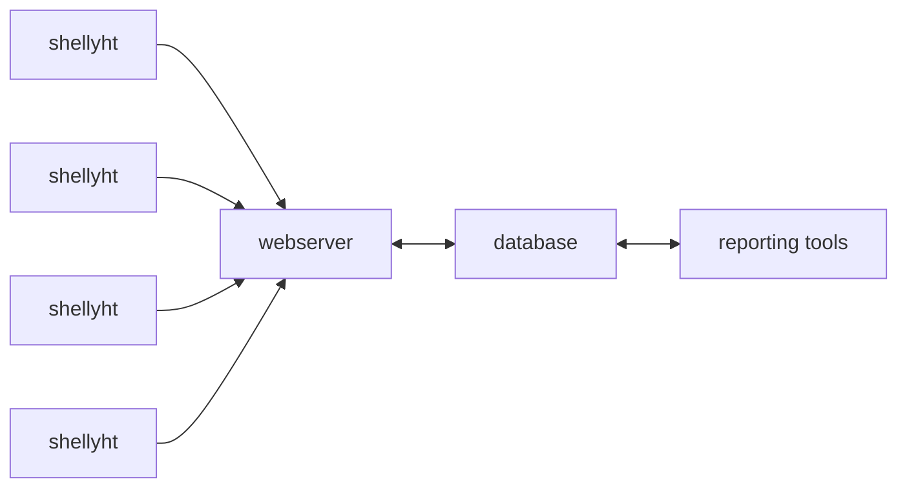

# Shellyhtcollector2

Gather incoming temperature and humidity updates from a small swarm of Shellyht devices.

## Architecture overview


## Install mariadb connector for Python
The python module is not pure Python and depends on libmariadb, so setup is less straight forward than you would hope:
``` bash
wget https://downloads.mariadb.com/MariaDB/mariadb_repo_setup
echo "d4e4635eeb79b0e96483bd70703209c63da55a236eadd7397f769ee434d92ca8  mariadb_repo_setup"     | sha256sum -c -
chmod +x mariadb_repo_setup
sudo ./mariadb_repo_setup    --mariadb-server-version="mariadb-10.6"
sudo apt install libmariadb3 libmariadb-dev
sudo python3 -m pip install mariadb
```
Here we have chosen to install it for everyone, but if you used a virtual environment your could do away with the `sudo`s

## Install the package

We don't provide a PyPi package but you can simply clone it from GitHub, so nothing get's installed but you can run it from the cloned directory.
```bash
git clone https://github.com/varkenvarken/shellyhtcollector2.git
```
Assuming you have MariaDB running on the same machine and that the user defined in the environment variable DBUSER has enough privileges to create a database, the following command will create a database (schema) `shellyht` and start listening for icoming connections:
```bash
(cd shellyhtcollector; nohup python3 -m shellyhtcollector -p 1883 &)
```
## Additional configuration

The reporting tools assume that a table `StationidToName` exists that contains a mapping between StationId and Name.

A mapping for a stationid can be added or updated with the mapping tool, for example:

```
(cd shellyhtcollector; PYTHONPATH=`pwd` python3 tools/mapping.py "shellyht-6A566F" "dining room")
```

## Generating reports
An html file with the last recorded measurements can be generated with:
```
(cd shellyhtcollector; PYTHONPATH=`pwd` python3 tools/last.py --html > index.html)
```

Both commands assume that you have set two environment variables

- DBUSER
- DBPASSWORD

## Implementation details

A ShellyHT can be configured to log temperature and humidity changes to a certain host:port using HTTP. 

A typical request will look for example like:

```
/sensorlog?hum=54&temp=23.4&id=shellyht-6A566F
```

The Webserver will only accept GET request that have that exaxt format.


